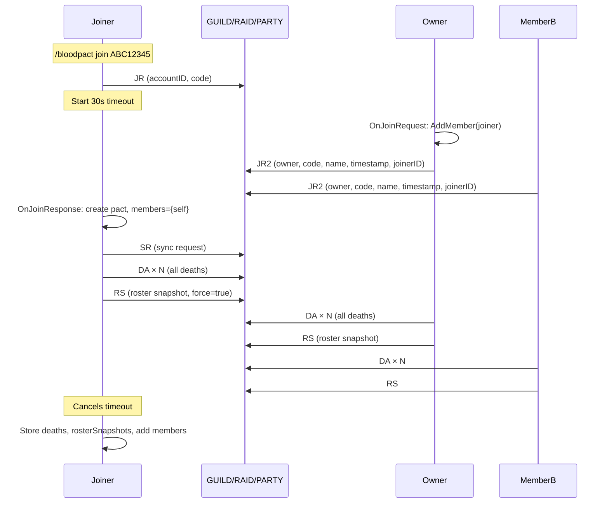
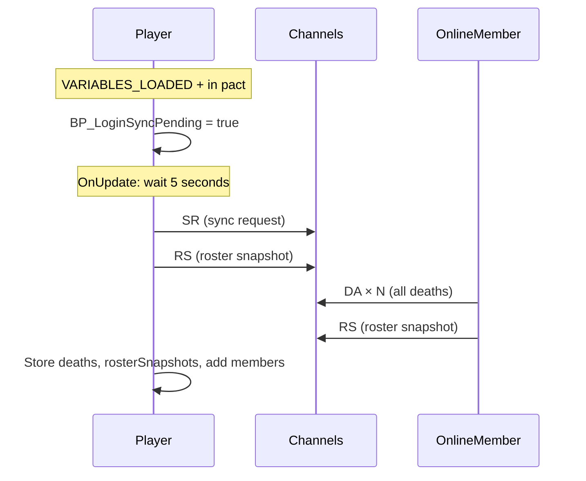
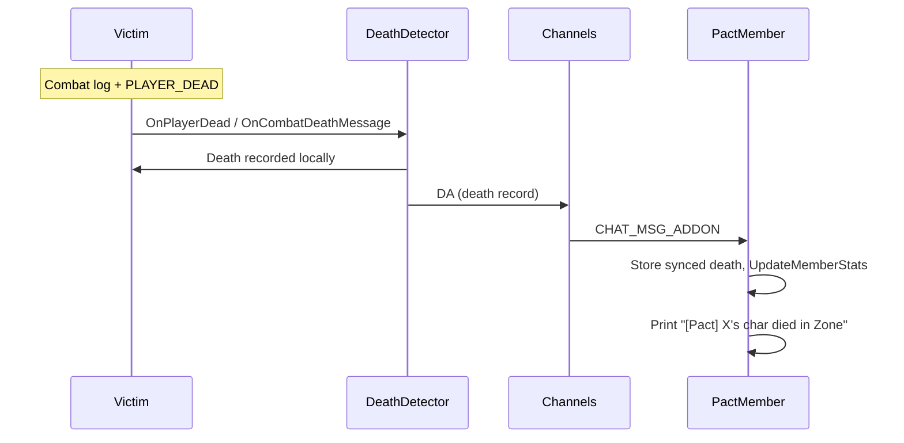
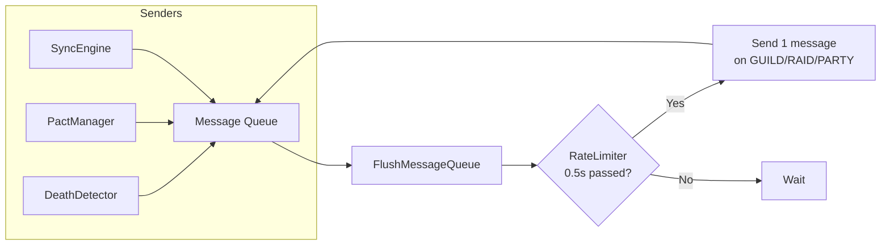

# Blood Pact — Sync Protocol & Network Diagrams

This document diagrams the addon message flow, message types, triggers, and timing for the Blood Pact synchronization system.

---

## Message Types

| Code | Name | Direction | Payload |
|------|------|-----------|---------|
| `JR` | Join Request | Joiner → Broadcast | accountID, pactCode |
| `JR2` | Join Response | Pact member → Broadcast | ownerID, pactCode, pactName, createdTimestamp, newMemberID |
| `SR` | Sync Request | Requester → Broadcast | accountID, pactCode |
| `DA` | Death Announce | Sender → Broadcast | senderID, pactCode, deathRecord |
| `RS` | Roster Snapshot | Sender → Broadcast | senderID, pactCode, charName, class, level, copper, professions |
| `OT` | Ownership Transfer | Sender → Broadcast | pactCode, oldOwnerID, newOwnerID |
| `CK` | Chunk | Sender → Broadcast | senderID, pactCode, msgID, chunkIdx, totalChunks, payload |

**Channels:** All messages are sent via `SendAddonMessage(prefix, msg, channel)` on GUILD, RAID, or PARTY (whichever is available). Messages are limited to 254 bytes; larger messages are chunked (CK).

---

## Timing Constants

| Constant | Value | Purpose |
|----------|-------|---------|
| `BLOODPACT_RATE_LIMIT_INTERVAL` | 0.5s | Minimum delay between sent messages (queue flush) |
| `BLOODPACT_JOIN_TIMEOUT` | 30s | Max wait for join response before giving up |
| `BLOODPACT_SYNC_REQUEST_DELAY` | 5s | Delay after login before sending sync request |
| `BLOODPACT_CHUNK_TIMEOUT` | 30s | Chunk reassembly buffer expiry |
| `BLOODPACT_MSG_CHUNK_SIZE` | 200 bytes | Max payload per chunk |

---

## Trigger Summary

| Trigger | Actions |
|---------|---------|
| **User: `/bloodpact create`** | Local pact creation only (no network) |
| **User: `/bloodpact join <code>`** | Broadcast JR → wait up to 30s for JR2 |
| **User: `/bloodpact setmain`** | Broadcast RS (if in pact, on main) |
| **Receive JR** | If in pact & code matches: Broadcast JR2; owner calls AddMember |
| **Receive JR2** | If pending join & code matches: create local pact, Send SR, Broadcast DA×N, Broadcast RS(force) |
| **Receive SR** | Broadcast DA×N, Broadcast RS |
| **Receive DA** | Store synced death, UpdateMemberStats, refresh UI |
| **Receive RS** | AddMember(sender), store rosterSnapshots[sender], refresh UI |
| **Receive OT** | Apply ownership transfer |
| **Player death** | Save locally, Broadcast DA |
| **PLAYER_LEVEL_UP** | Broadcast RS (if in pact & on main) |
| **VARIABLES_LOADED + in pact** | Schedule: after 5s → Send SR, Broadcast RS |
| **OnUpdate (every 0.5s)** | FlushMessageQueue (send 1 queued message) |
| **OnUpdate (every 5s)** | CleanExpiredChunks |

---

## Sequence Diagrams

### 1. Pact Creation

```
Creator                              World
   |                                    |
   | /bloodpact create "My Pact"        |
   |----------------------------------->|
   | Create local pact (members=self)   |
   | (no network messages)              |
   |                                    |
```

### 2. Pact Join Flow



### 3. Post-Login Sync



### 4. Death Broadcast



### 5. Message Queue & Rate Limiting



### 6. Roster Snapshot Triggers

```mermaid
flowchart TD
    subgraph "BroadcastRosterSnapshot() called from"
        T1[OnJoinResponse<br/>force=true]
        T2[OnSyncRequest response]
        T3[Post-login 5s]
        T4[PLAYER_LEVEL_UP]
        T5[/bloodpact setmain]
        T6[Settings: main change]
    end

    T1 --> RS[Broadcast RS]
    T2 --> RS
    T3 --> RS
    T4 --> Check{On main char?}
    T5 --> Check
    T6 --> Check
    Check -->|Yes| RS
    Check -->|No| Skip[Skip broadcast]
```

---

## Data Flow: Who Learns What

| Source | Creator | Joiner A | Joiner B |
|--------|---------|----------|----------|
| **Members list** | AddMember on each JR | AddMember on RS/DA | AddMember on RS/DA |
| **Creator's level** | Local GetCurrentSnapshot | RS from creator | RS from creator |
| **A's level** | RS from A | Local GetCurrentSnapshot | RS from A |
| **B's level** | RS from B | RS from B | Local GetCurrentSnapshot |
| **Deaths** | Local + synced | Local + synced | Local + synced |

---

## Event → Handler Chain

```
WoW Event              Core/Module              SyncEngine
─────────────────────────────────────────────────────────────
CHAT_MSG_ADDON    →    OnAddonMessage()    →    Route by msg type
                                               (DA, JR, JR2, SR, RS, OT, CK)

OnUpdate (0.5s)   →    FlushMessageQueue()     Send 1 msg to GUILD/RAID/PARTY
                                               (rate-limited)

PLAYER_DEAD       →    DeathDetector       →    BroadcastDeath()
CHAT_MSG_COMBAT_* →    DeathDetector       →    BroadcastDeath()

VARIABLES_LOADED  →    BP_LoginSyncPending      (5s later) SendSyncRequest()
                                               + BroadcastRosterSnapshot()

PLAYER_LEVEL_UP    →    BroadcastRosterSnapshot()  [if on main]
```
